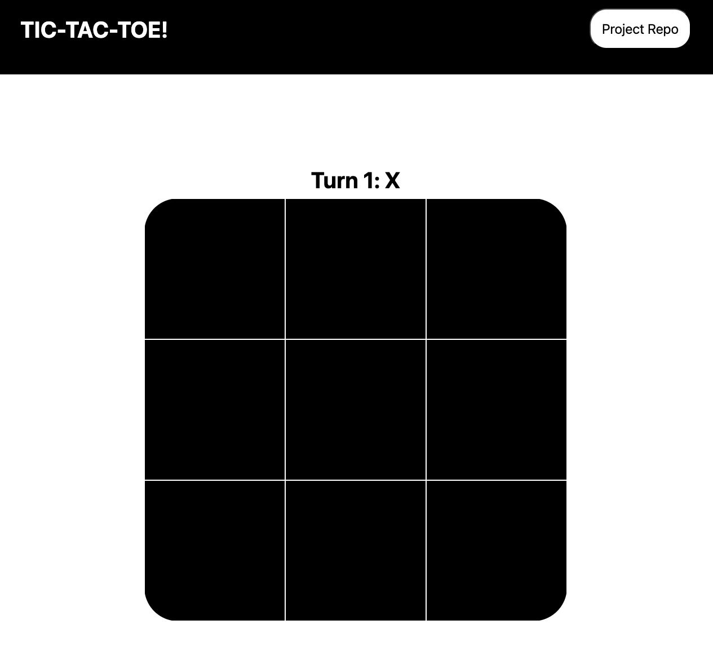

# Tic-Tac-Toe

A browser-based two-player Tic-Tac-Toe game built with plain HTML, CSS, and JavaScript.

## [Try it out](https://theamanali.github.io/tic-tac-toe/)


## Features

- Two-player local gameplay (Player X vs Player O)
- Optional player names (defaults to `X` and `O` when left blank)
- Turn indicator (`Turn N: Player`)
- Win detection for all 8 winning combinations
- Draw detection after 9 turns
- End-of-game modal with restart options:
  - `Play Again`
  - `Play Again (new players)`

## Tech Stack

- HTML (`index.html`)
- CSS (`css/styles.css`)
- Vanilla JavaScript (`js/script.js`)

## Getting Started

1. Clone the repository:

```bash
git clone https://github.com/theamanali/tic-tac-toe.git
cd tic-tac-toe
```

2. Open `index.html` in your browser.

## How to Play

1. Enter names for Player One and Player Two (optional).
2. Click `Start Game`.
3. Take turns clicking cells on the 3x3 board.
4. The game ends when a player gets 3 in a row or when the board is full.
5. Use the modal buttons to restart with same or new players.

## Code Overview

`js/script.js` is organized into three main pieces:

- `createPlayer(name, marker)`: player factory (name/marker setup and accessors)
- `Game(player1, player2)`: game state + board state, turn progression, winner/draw checks, reset behavior
- `DisplayController`: UI rendering helpers (show/hide sections, place markers, update headers/dialog)

## License

This project is licensed under the MIT License. See `LICENSE` for details.
