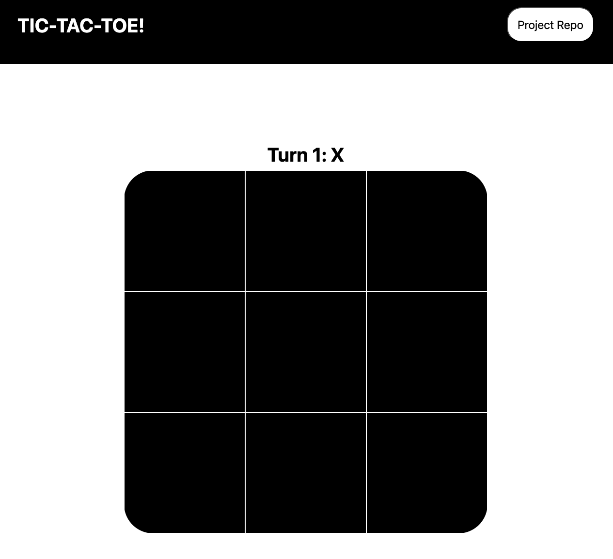

# Tic Tac Toe ❌⭕️

A browser-based Tic Tac Toe game built with HTML, CSS, and JavaScript as part of a JavaScript course. Implements modular code (IIFE & factory functions), minimal globals, and a clean UI.

## 🚀 Try it out


## ✨ Features
- Custom Player Names: Enter names (or default to “X” / “O”)  
- Turn Indicator: Displays “Turn 1: Alice”, “Turn 2: Bob”, etc.  
- Interactive 3×3 Grid: Click any empty cell to place your marker  
- Win & Draw Detection: Automatically checks all 3-in-a-row combos and ties  
- Winner Modal: Shows the outcome with “Play Again” (same players) or “Play 
  Again (new players)”

### To add:  
- Single-player vs. AI mode  
- Mobile-optimized styling  

## 🛠️ Installation
1. Clone the repo
   ```
   git clone https://github.com/theamanali/tic-tac-toe.git
   ```
2. Navigate into the folder
   ```
   cd tic-tac-toe
   ```
3. Open in your browser
   ```
   open index.html
   ```
   
## 🧰 Technologies Used
- **HTML5** – Semantic structure and accessibility
- **CSS3** – Grid & Flexbox layouts, responsive styling
- **JavaScript (ES6+)** – IIFE modules, factory functions, DOM manipulation

## 💳 Credits
- **The Odin Project** – Project specification & guidance

## 📄 License
This project is licensed under the **MIT License**. See the [LICENSE](LICENSE) file for details.
